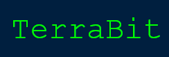

TerraBit is game demonstration to show how to use publicly verifiable onchain randomness and delayed transactions in dapps built on the [ETF network](https://etf.idealabs.network).

<p align="center">
     
</p>

Built with [etf.js](https://github.com/ideal-lab5/etf.js) and [react-three-fiber](https://github.com/pmndrs/react-three-fiber).

## Run

Run 

```
npm i
npm run start
```

## Configuration

The application expects a `.env` file to exist with a reference to the deployed [terrabit contract](https://github.com/ideal-lab5/contracts/tree/main/examples/transmutation).

For example:

``` 
REACT_APP_CONTRACT_ADDRESS="5Gw1ejgmYXR4YRch7AmrTdDyrdoLsEM54Aws34nQaXYWrzqj"
```